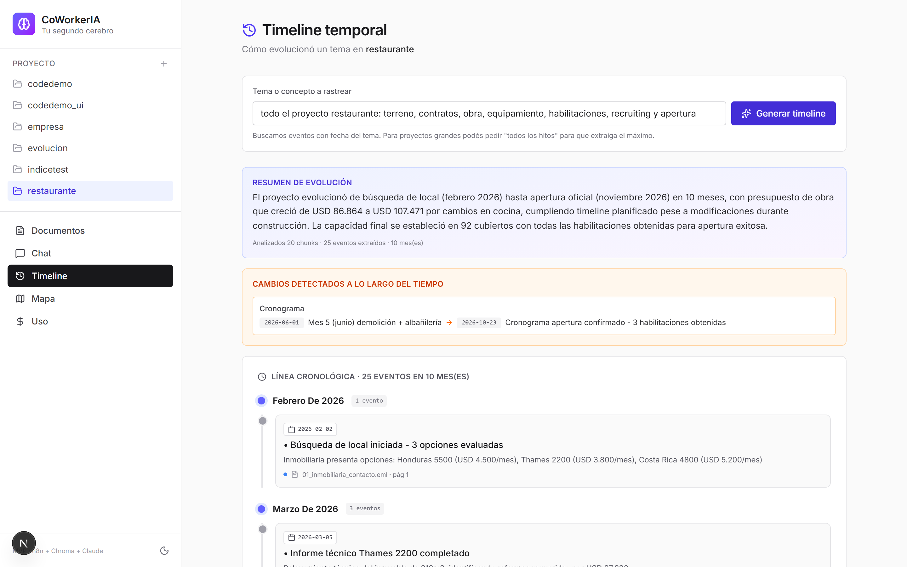
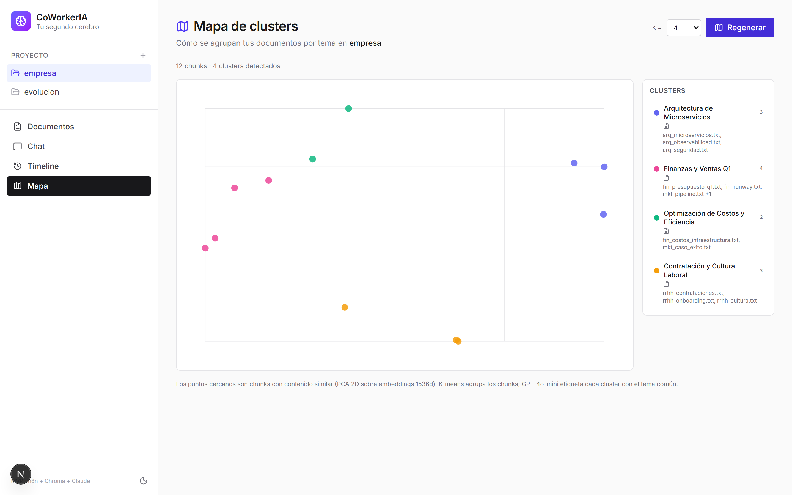
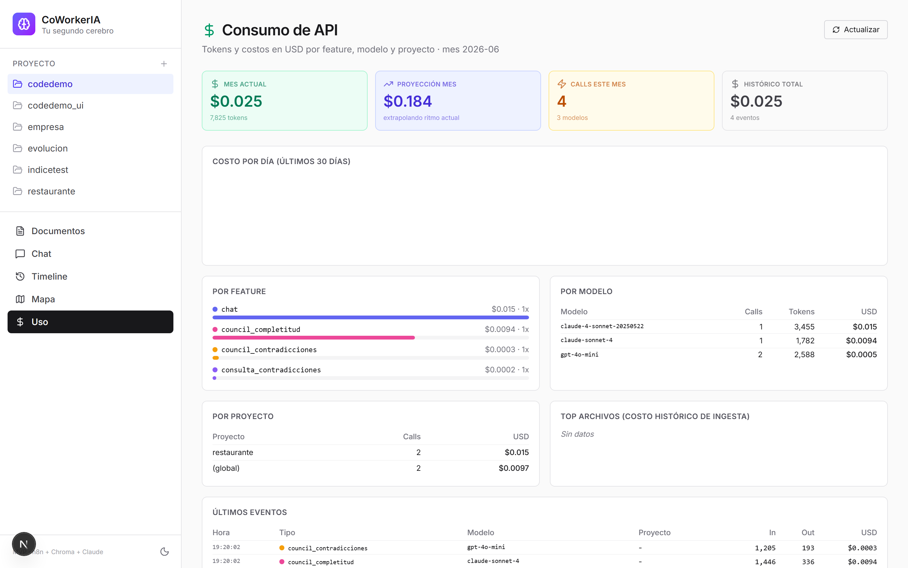
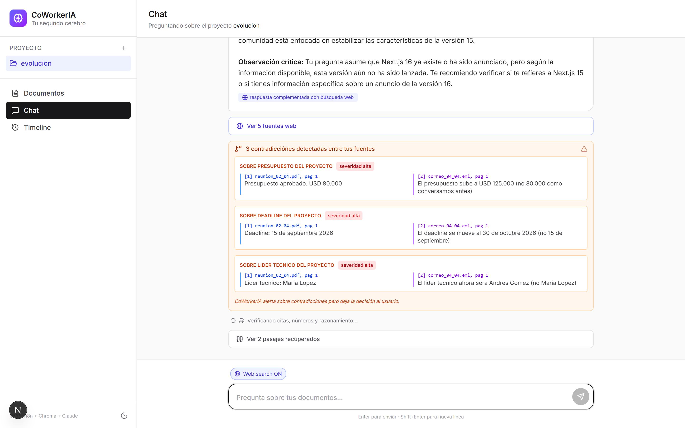

# CoWorkerIA 🧠

> **Tu segundo cerebro para proyectos e investigación.** Subís todos tus documentos —PDFs, Word, Excel, correos, imágenes, código— y le preguntás como a un colega experto. Recibís respuestas con **fuente exacta**, validadas por un panel de LLMs y con detección automática de contradicciones entre tus fuentes.

[]() []() []() []() []()

CoWorkerIA es un asistente de conocimiento **local-first** construido sobre n8n. Combina **RAG jerárquico** (índice + chunks), **validación deterministic + LLM council**, **detección de contradicciones**, **timeline temporal** y **mapa de clusters** para que tu cerebro digital no solo *busque*, sino que *entienda*.

---

## ✨ Capturas

| | |
|---|---|
| **Documentos** (drag & drop carpetas completas) |  |
| **Chat con citas inline + memoria + estado vivo** |  |
| **Timeline auto-cargado** (eventos del proyecto agrupados por mes) |  |
| **Mapa de clusters temáticos** (PCA + K-means + labels LLM) |  |
| **Dashboard de consumo** (tokens + USD por feature) |  |
| **Chat con web search + contradicciones** |  |
| **Dark mode** |  |
| **Responsive móvil** |  |

---

## 🚀 Capacidades

### Ingesta multi-formato (40+ tipos)

| Categoría | Formatos | Procesamiento |
|---|---|---|
| **Documentos** | PDF, DOCX | PyMuPDF + per-page extraction (citas con página real), tablas detectadas como markdown |
| **PDFs escaneados** | PDF imagen | OCR vía **Claude Vision** (sin Tesseract local) |
| **Hojas de cálculo** | XLSX, XLS | Datos + **fórmulas preservadas** + merged cells + fechas ISO |
| **Correos** | EML (Gmail/Outlook export) | Headers (from/to/cc/date/subject) + body chunkado con contexto |
| **Imágenes** | JPG, PNG, GIF, WEBP | OCR + descripción visual vía Claude Vision |
| **Notebooks** | IPYNB | Celdas markdown + código preservadas, outputs ignorados |
| **Código** | .py .js .ts .tsx .go .rs .java .sql .json .yaml .sh y 25+ más | Chunking **code-aware** que respeta funciones y queries SQL |
| **Texto** | TXT, MD, MARKDOWN, RST | Ingest directo |
| **Carpetas completas** | (recursivo) | Subida con drag & drop o picker; skip automático de `node_modules/`, `.git/`, `__pycache__/`, `dist/`, etc. |

### RAG jerárquico (2 niveles)

```
📦 NIVEL 1 — Índice de archivos (auto-generado al ingerir)
   Cada archivo tiene su resumen + temas + entidades clave embedidos
   
🔍 NIVEL 2 — Chunks granulares (clásico RAG)
   Top-K chunks con embeddings de 1536 dim (OpenAI text-embedding-3-small)

Consulta:
  Pregunta → Nivel 1 (top archivos relevantes) → Nivel 2 (chunks SOLO de esos) → Claude
              ↑ mapa global                       ↑ zoom específico
```

Esto soluciona la limitación de top-K bajo para preguntas amplias sobre codebases o carpetas grandes (cientos de archivos).

### Validación de respuestas: Council híbrido

Antes de mostrar cada respuesta, un panel verifica:

| Layer | Cómo | Costo |
|---|---|---|
| **Verificaciones deterministas (código)** | Citas `[archivo, pag. N]` → existe? · Números → aparecen en el contexto? · Entidades → están mencionadas? | $0 |
| **Juez completitud** (Claude Sonnet 4) | ¿Omite información crítica de los pasajes? | ~$0.003 |
| **Juez contradicciones** (GPT-4o-mini) | ¿Hay contradicciones internas o ambigüedades? | ~$0.0005 |

Badge en el chat: 🟢 fundamentada · 🟡 con observaciones · 🔴 posibles alucinaciones. Click para ver detalles de cada juez.

### Detección automática de contradicciones entre fuentes (Fase 3 PRD)

Cuando los chunks recuperados se contradicen entre sí (ej: presupuesto $80k en PDF del 02/04 vs $125k en email del 04/04), un detector LLM las identifica, Claude las flagea en su respuesta, y aparecen en un panel separado con severidad alta/media/baja. **Decisión queda al usuario** (alineado con principio del PRD).

### Timeline temporal (Fase 3 PRD)

Vista `/timeline` auto-cargada al entrar: el sistema extrae automáticamente todos los hitos datables del proyecto, los agrupa por mes y destaca los aspectos que cambiaron en el tiempo. Refinable por búsqueda específica. Cache 24h por proyecto.

### Mapa de clusters temáticos (Fase 4 PRD)

Vista `/mapa`: PCA reduce los embeddings a 2D, K-means agrupa los chunks (k auto o ajustable 2-10), GPT-4o-mini genera labels temáticos para cada cluster. Scatter plot interactivo. Permite ver cómo se organiza tu conocimiento sin haberlo etiquetado manualmente.

### Memoria conversacional + Contexto vivo del proyecto

- **Memoria**: el chat recuerda los últimos 10 turnos (persistido en localStorage por proyecto). Podés preguntar *"y entonces?"*, *"comparado con lo anterior"*, etc.
- **Contexto vivo**: card colapsable arriba del chat con un resumen LLM del estado actual del proyecto + tags de temas + últimos archivos ingestados. Se incluye en cada pregunta como super-system-prompt para que Claude tenga visión global más allá del retrieval. Cache 24h.

### Búsqueda web mixta (Fase 2 PRD)

Toggle 🌐 en el chat → Claude complementa lo que no esté en tus fuentes con búsqueda web vía OpenRouter (Exa-powered). Las citas se diferencian: `[archivo, pag. N]` para tus docs vs `[web: título]` para fuentes externas.

### Dashboard de consumo

Vista `/uso` con tracking en tiempo real de tokens y costo USD (OpenRouter devuelve `cost` nativo). Breakdown por feature (chat / council / ingesta / timeline / clusters / vision) · por modelo · por proyecto · gráfico de costo diario 30d · top archivos consumidores · log de últimos eventos. Auto-refresh 15s.

---

## 📊 Estado del MVP por funcionalidad del PRD

| # | Función | Estado |
|---|---|---|
| F1 | Guardar documento | ✅ 40+ formatos · carpetas completas · skip automático de noise |
| F2 | Procesamiento automático | ✅ chunking + embeddings + indexación en 2 niveles |
| F3 | Chat sobre el conocimiento | ✅ Claude Sonnet 4 vía OpenRouter |
| F4 | Búsqueda semántica | ✅ Chroma con filtro por proyecto + **hierarchical RAG** |
| F5 | Citas exactas | ✅ `[archivo, pag. N]` con página REAL para PDFs |
| F6 | Modo conservador | ✅ "no encontré eso en tus fuentes" cuando aplica |
| F7 | Modo crítico | ✅ "Observación crítica" + Council valida fundamentación |
| F8 | Gestión de documentos | ✅ ls + rm + UI con drag&drop + bulk upload |
| F9 | Concepto de proyecto/tema | ✅ selector en sidebar + filter en CLI |
| **F10** | **Detección de contradicciones** (Fase 3) | ✅ Detector LLM + UI panel separado con severidad |
| **F11** | **Timeline temporal** (Fase 3) | ✅ Vista auto-cargada con eventos agrupados por mes |
| **F12** | **Búsqueda web mixta** (Fase 2) | ✅ Toggle 🌐 + plugin web de OpenRouter |
| **F13** | **Mapa de clusters** (Fase 4) | ✅ PCA + K-means + labels LLM |
| **F14** | **Dashboard de consumo** | ✅ Tokens + USD por feature/modelo/proyecto + gráficos |
| **F15** | **Memoria conversacional** | ✅ Historia de 10 turnos en localStorage por proyecto |
| **F16** | **Contexto vivo del proyecto** | ✅ Resumen auto-actualizado pasado a Claude en cada query |
| **F17** | **Validación con LLM Council híbrido** | ✅ Tools deterministic + 2 jueces (Claude + GPT-4o-mini) |
| **F18** | **OCR de PDFs escaneados** | ✅ Vía Claude Vision (sin Tesseract local) |

**Fases 1, 2, 3 y 4 (parte principal) del PRD — completas.**

---

## 🏗 Arquitectura

```
┌──────────────────┐   ┌───────────────────┐   ┌───────────────────┐
│  CLI Python      │   │  Web UI           │   │  Cualquier        │
│  (ingest/ask/    │   │  Next.js 16       │   │  cliente via      │
│   ls/rm)         │   │  + Tailwind v4    │   │  webhook          │
└────────┬─────────┘   └────────┬──────────┘   └─────────┬─────────┘
         │                      │                        │
         └──────────────────────┼────────────────────────┘
                                ▼
              ┌────────────────────────────────────────┐
              │       n8n — orquestación (local)       │
              │  ┌──────────────────────────────────┐  │
              │  │ Ingesta texto + indexación       │  │
              │  │ Consulta RAG (con detector       │  │
              │  │   de contradicciones)            │  │
              │  │ Consejo Respuesta (council)      │  │
              │  │ Timeline Temporal                │  │
              │  └──────────────────────────────────┘  │
              └──────────────┬─────────────────────────┘
                             │
        ┌────────────────────┼────────────────────────┐
        ▼                    ▼                        ▼
   ┌──────────────┐    ┌──────────────┐    ┌────────────────────┐
   │  Chroma      │    │  OpenRouter  │    │  OpenRouter        │
   │  vectorDB    │    │  embeddings  │    │  LLMs (multi)      │
   │  ─ chunks    │    │  text-       │    │  ─ Claude Sonnet 4 │
   │  ─ índice    │    │  embedding-  │    │  ─ GPT-4o-mini     │
   │              │    │  3-small     │    │  ─ + web plugin    │
   └──────────────┘    └──────────────┘    └────────────────────┘
```

**Stack:**

| Capa | Tecnología | Por qué |
|---|---|---|
| Orquestación | [n8n](https://n8n.io/) (local) | 4 workflows visuales versionados como JSON en `n8n/workflows/` |
| Base vectorial | [Chroma](https://www.trychroma.com/) (Python local) | 2 colecciones: `coworkeria` (chunks 1536d) + `coworkeria_indice` (resúmenes) |
| Embeddings | OpenAI `text-embedding-3-small` vía [OpenRouter](https://openrouter.ai/) | 1536d, multilingüe, $0.02/1M tokens |
| LLM principal | Anthropic Claude Sonnet 4 vía OpenRouter | Mejor razonamiento y citado |
| LLM económicos | GPT-4o-mini (detector contradicciones, jueces, labels clusters, índice) | $0.15/1M tokens |
| CLI | Python (stdlib + chromadb + python-docx + pymupdf + openpyxl) | Sin dependencias web pesadas |
| Web UI | [Next.js 16](https://nextjs.org/) + Tailwind v4 + lucide-react | App Router · server-side processing · SVG charts manual |

---

## ⚡ Cómo correrlo

**Requisitos:** Node ≥ 18 · Python ≥ 3.11 · una API key de [OpenRouter](https://openrouter.ai/keys) (cubre LLM + embeddings con una sola key).

### 1. Setup inicial (una vez)

```bash
# Clonar
git clone https://github.com/JunTierSS/coworkeria.git
cd coworkeria

# Configurar .env
cp .env.example .env
# Editar .env: poner OPENROUTER_API_KEY

# Instalar deps Python
pip install chromadb reportlab python-docx pymupdf openpyxl pillow mailparser python-magic

# Instalar deps UI
cd ui && npm install && cd ..
```

### 2. Levantar servicios (en terminales separadas)

```bash
# Terminal A — Chroma
chroma run --path ./data/vectordb --host localhost --port 8000
```

```bash
# Terminal B — crear colecciones + setear UUIDs en .env (una vez)
python -c "
import chromadb, re
from pathlib import Path
c = chromadb.HttpClient(host='localhost', port=8000)
col = c.get_or_create_collection('coworkeria')
idx = c.get_or_create_collection('coworkeria_indice')
env = Path('.env').read_text(encoding='utf-8')
env = re.sub(r'^CHROMA_COLLECTION_ID=.*$', f'CHROMA_COLLECTION_ID={col.id}', env, flags=re.MULTILINE)
env = re.sub(r'^CHROMA_INDICE_ID=.*$', f'CHROMA_INDICE_ID={idx.id}', env, flags=re.MULTILINE)
Path('.env').write_text(env, encoding='utf-8')
print(f'Coleccion chunks: {col.id}')
print(f'Coleccion indice: {idx.id}')
"
```

```bash
# Terminal C — n8n (con env vars + acceso a $env en nodos)
set -a && source .env && set +a && export N8N_BLOCK_ENV_ACCESS_IN_NODE=false && npx n8n
# → http://localhost:5678
# crear cuenta owner local + importar workflows desde n8n/workflows/
```

```bash
# Terminal D — UI
cd ui
cp ../.env .env.local   # o copiar solo N8N_URL, CHROMA_URL, CHROMA_COLLECTION_ID, CHROMA_INDICE_ID
npm run dev
# → http://localhost:3000
```

### 3. Importar workflows en n8n

UI de n8n → menú **⋮** arriba a la derecha → **Import from File**:

- `n8n/workflows/ingesta_texto.json` (con generación de índice automática)
- `n8n/workflows/consulta_rag.json` (con detector de contradicciones + hierarchical RAG)
- `n8n/workflows/consejo_respuesta.json` (council híbrido)
- `n8n/workflows/timeline_temporal.json`

Activar los 4 con el toggle.

### 4. Usar

**Web UI (recomendado):** `http://localhost:3000`
- **Documentos** — drag & drop archivos o carpetas completas
- **Chat** — preguntas con citas, contradicciones, memoria, contexto vivo
- **Timeline** — eventos datables agrupados por mes (auto-carga)
- **Mapa** — clusters temáticos
- **Uso** — consumo de tokens y USD

**CLI:**
```bash
python scripts/coworkeria.py ingest mi.pdf --proyecto tesis
python scripts/coworkeria.py ingest /carpeta/entera --proyecto proyecto  # próximamente
python scripts/coworkeria.py ask "qué dice sobre X?" --proyecto tesis
python scripts/coworkeria.py ls
python scripts/coworkeria.py rm mi.pdf --proyecto tesis
```

### 5. Demo dataset (opcional)

Hay un seed con un proyecto realista de **10 meses** (apertura de un restaurante "Cocina del Río") con 36 documentos (PDFs, Excels, correos) que incluye **contradicciones intencionales** para demostrar el sistema:

```bash
python scripts/seed_restaurante.py
# → genera + ingiere todo bajo el proyecto 'restaurante'
```

Luego abrí la web UI, seleccioná `restaurante`, y probá:
- *"¿cuál es el presupuesto total y cuánto cambió durante la obra?"* → detecta cambio $86k → $107k + 3 contradicciones automáticas
- *"qué cambios hubo en la cocina?"* → email solicitud + xlsx re-presupuesto + email aprobación
- Andá a Timeline → 25-40 hitos del proyecto agrupados por mes
- Andá a Mapa → clusters temáticos (contratos, finanzas, recruiting, equipamiento)

---

## 🎯 Para quién es esto

| Persona | Caso de uso |
|---|---|
| **📚 Investigador / Tesista** | 200 papers + notas + bibliografía con citas verificables |
| **⚖️ Abogado / Estudio jurídico** | Expediente con 500 docs, detección de contradicciones entre testimonios |
| **💼 Consultor / Analista** | 5 clientes como proyectos separados, recuperar "qué pidió X en la reunión" |
| **🚀 Product Manager / Founder** | PRDs + retros + feedback + métricas, timeline de decisiones |
| **👨‍💻 Engineering Lead** | Repo entero + docs + ADRs, "¿por qué elegimos Postgres?" |
| **🏥 Médico / Investigador clínico** | Historiales + papers + guías, detección de contradicciones entre estudios |
| **📊 CFO / Operaciones** | Excels + reportes + decks, timeline de gastos y métricas |

**El nicho real:** trabajo profesional con información que importa, donde no podés permitirte que la IA invente, donde necesitás defender lo que decís citando, y donde tener tu cerebro corporativo offline es ventaja competitiva (o requisito legal).

---

## 🛣 Roadmap

| Fase | Estado | Pendiente |
|---|---|---|
| **1 — MVP** | ✅ completo | — |
| **2 — Más fuentes** | ✅ mayor parte | OAuth Gmail/Outlook (sync continuo) |
| **3 — Inteligencia temporal** | ✅ completo | — |
| **4 — Visualización e ingesta** | ✅ mayor parte (mapa de clusters) | Extensión navegador (guardar de un click) |
| **5 — Colaboración** | ⏳ pendiente | Modo equipo (cerebro compartido) |

---

## 🧪 Decisiones técnicas notables

- **Chroma sobre Qdrant:** Qdrant requiere Docker Desktop; en Windows el daemon Linux de Docker tarda 5+ min en arrancar. Chroma corre nativo con `pip install` y tiene API REST decente.
- **OpenRouter sobre Anthropic directo:** una sola key cubre LLM (Claude Sonnet 4), embeddings (OpenAI text-embedding-3-small) y modelos económicos (gpt-4o-mini). Devuelve `cost` USD nativo en cada response, perfecto para el dashboard de consumo.
- **Hierarchical RAG (índice + chunks):** dos colecciones Chroma separadas. El índice usa `gpt-4o-mini` (~$0.001/archivo) para resumir cada doc al ingerir; al consultar primero filtramos por archivo relevante, después por chunks. Soluciona el clásico problema de top-K bajo en codebases grandes.
- **Council híbrido (tools + jueces):** las verificaciones críticas (existencia de cita, número en contexto, entidad en contexto) las hace código JavaScript; solo el razonamiento blando (completitud, contradicciones lógicas) va a 2 LLMs. 5x menos tokens que un council "puro" de 3 jueces redundantes.
- **Pre-extracción server-side:** n8n no tiene loaders nativos para Word/Excel/EML/imágenes. Solución: mammoth.js / xlsx (SheetJS) / mailparser / Claude Vision en el API route de Next.js (server-side) y librerías Python equivalentes en el CLI. Ambos postean texto plano al mismo workflow `ingesta-texto`.
- **PDF v2 (pdf-parse 2.x):** la API cambió de función directa a clase `PDFParse`. Hay que tratar `pdf-parse` como external en `next.config.ts` (`serverExternalPackages`) porque Turbopack no empaca bien los workers de pdfjs-dist.
- **Skip de carpetas noise:** al subir carpetas, ignoramos `node_modules/`, `.git/`, `__pycache__/`, `dist/`, `.next/`, `.venv/`, etc. para evitar miles de archivos basura.

---

## 📁 Estructura del repo

```
coworkeria/
├── docs/                          PRD + ROADMAP + screenshots
│   ├── PRD.md
│   ├── ROADMAP.md
│   └── screenshots/               capturas para el README
├── n8n/workflows/                 4 workflows JSON versionados
│   ├── ingesta_texto.json
│   ├── consulta_rag.json
│   ├── consejo_respuesta.json
│   └── timeline_temporal.json
├── scripts/
│   ├── coworkeria.py              CLI (ingest / ask / ls / rm)
│   ├── n8n_export_import.py       sync workflows ↔ git
│   ├── seed_restaurante.py        seed con proyecto demo 10 meses
│   └── screenshots.py             captura UI con Playwright
├── ui/                            Next.js 16 + Tailwind v4
│   └── src/
│       ├── app/
│       │   ├── page.tsx           Documentos (drag & drop)
│       │   ├── chat/              Chat con memoria + contexto vivo
│       │   ├── timeline/          Timeline auto-cargado
│       │   ├── mapa/              Mapa de clusters
│       │   ├── uso/               Dashboard de consumo
│       │   └── api/               9 API routes server-side
│       ├── components/            Sidebar · ProjectProvider · ThemeProvider
│       └── lib/                   config · uso (logger)
├── data/                          (privado, no commiteado)
│   ├── documentos/                originales
│   ├── vectordb/                  Chroma local
│   ├── estados/                   cache de estado vivo por proyecto
│   └── uso.jsonl                  log de consumo de API
├── .env.example                   plantilla de variables
└── CLAUDE.md                      briefing para sesiones con Claude Code
```

---

## 💰 Costos típicos

| Operación | Costo aprox |
|---|---|
| Ingestar 1 documento (con resumen para índice) | $0.001 |
| Una pregunta de chat (Claude Sonnet 4 + detector contradicciones) | $0.005 - 0.015 |
| Validación con Council híbrido (después de respuesta) | $0.003 - 0.005 |
| Timeline completo del proyecto | $0.01 (cache 24h) |
| Estado vivo del proyecto | $0.002 (cache 24h) |
| Mapa de clusters (k=4, 4 labels) | $0.001 |
| Web search por consulta | + $0.005 - 0.01 |
| OCR por página de PDF escaneado | $0.005 |

**Estimación uso intenso personal:** $5-15/mes. Comparado con ChatGPT Plus ($20/mes flat), sale más barato y tenés visibilidad granular.

---

## 🙋 Sobre este proyecto

CoWorkerIA combina **ingeniería de IA** (RAG jerárquico, embeddings, LLM council, vision, orquestación) con **pensamiento de producto** (PRD ejecutado disciplinadamente, principios no negociables, métricas, decisiones justificadas).

Forma parte de la familia de productos **CoWorker**.

**Autor:** [Jun Wei He Mai](https://github.com/JunTierSS)

## Licencia

MIT
