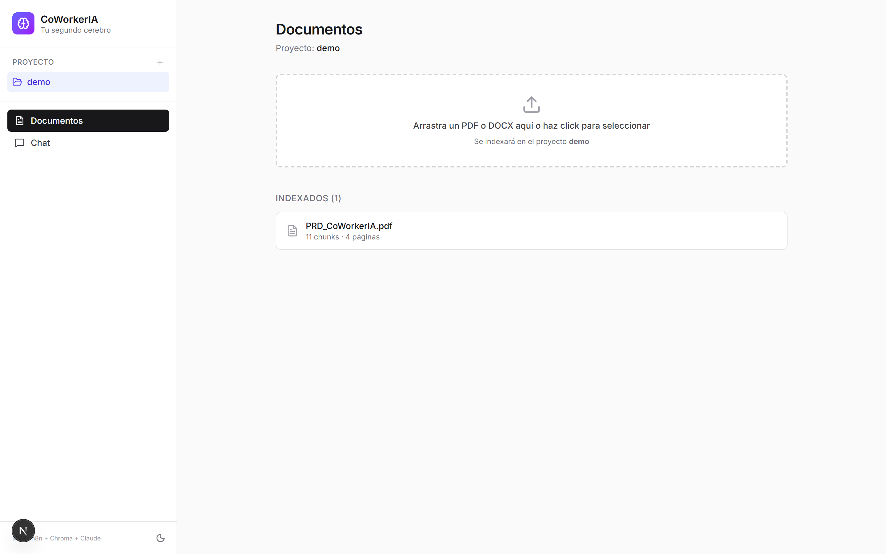
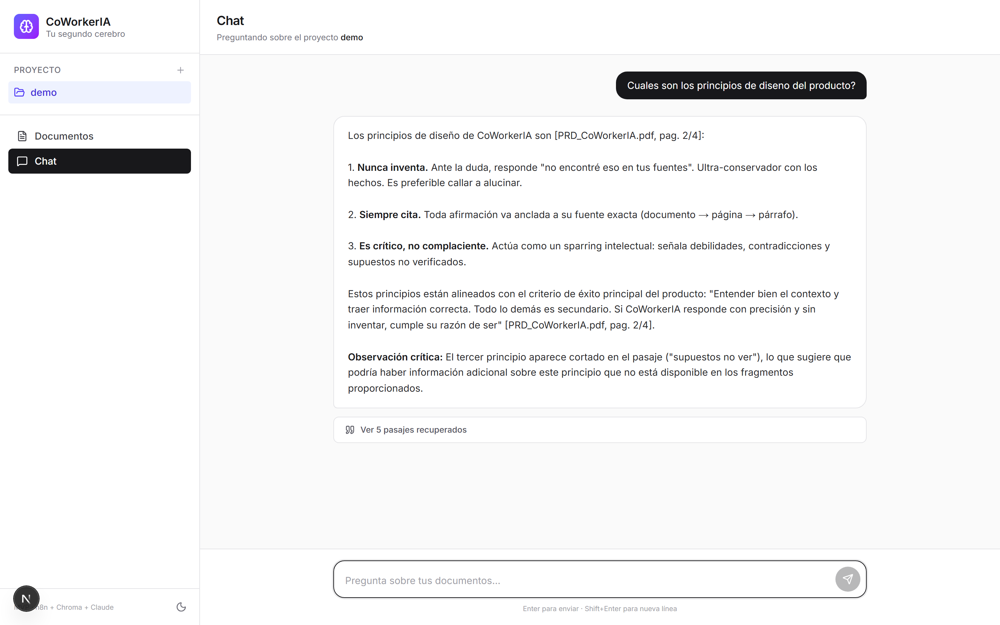
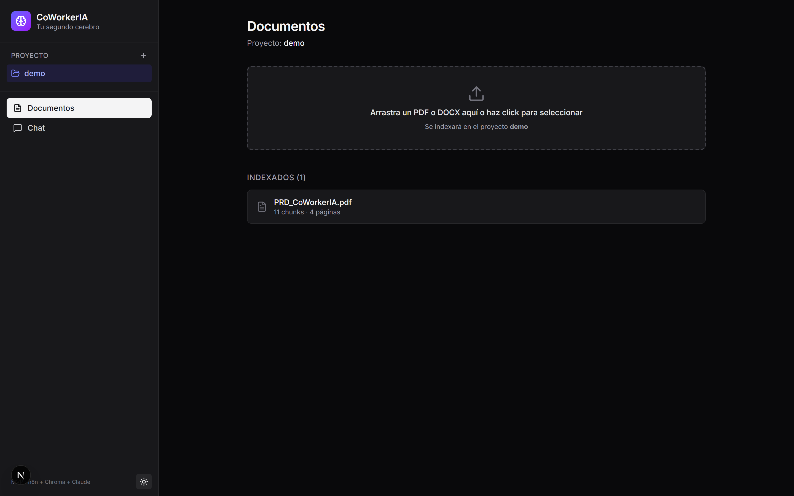
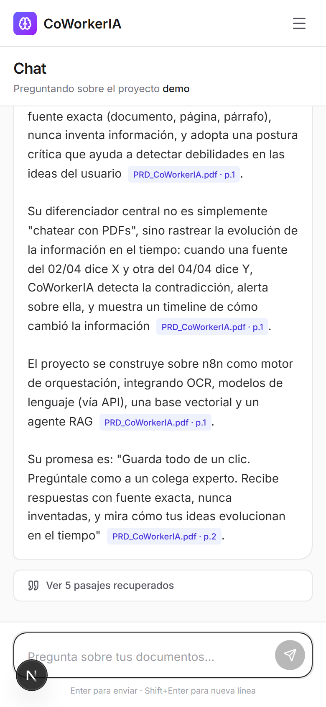

# CoWorkerIA

> **Tu segundo cerebro para proyectos e investigación.** Ingiere tus PDFs y Word, pregúntale como a un colega experto, y recibe respuestas con **fuente exacta** — sin inventar nunca.

[]() []() []() []()

CoWorkerIA es un asistente de conocimiento **local-first** que convierte documentos desordenados (PDFs, Word, texto) en un cerebro consultable mediante RAG (Retrieval-Augmented Generation). Cada respuesta cita la fuente exacta —documento + página— y nunca alucina: si no está en tus fuentes, lo declara.

---

## Por qué existe

> *Durante mi tesis de magíster leí decenas de papers. Semanas después necesitaba **aquella** idea, **aquel** dato — y no recordaba en qué documento estaba. Pasaba más tiempo buscando que usando la información.*

CoWorkerIA resuelve ese dolor con tres ingredientes:

1. **Local-first** — tus documentos no salen de tu máquina (solo la inferencia de IA usa la nube).
2. **Cita siempre** — toda afirmación viene anclada a doc + página + extracto, verificable.
3. **Nunca inventa** — modo conservador: si no encuentra, lo dice abiertamente.

---

## Capturas

| Vista | |
|---|---|
| **Documentos** |  |
| **Chat con citas inline** |  |
| **Dark mode** |  |
| **Responsive móvil** |  |

## Demo CLI

```bash
$ python scripts/coworkeria.py ingest mi_paper.pdf --proyecto tesis
  + Copiado a data\documentos\tesis__mi_paper.pdf
  + Indexado en Chroma: 12 chunk(s)

$ python scripts/coworkeria.py ask "Cuáles son los principios de diseño?" --proyecto tesis

? Pregunta: Cuáles son los principios de diseño?
> Respuesta:
Los principios no negociables son [mi_paper.pdf, pag. 3]:
1. Nunca inventa: si la información no está en las fuentes, lo declara
   abiertamente [mi_paper.pdf, pag. 3].
2. Siempre cita: toda afirmación se ancla a documento, página y párrafo
   [mi_paper.pdf, pag. 3].
3. Es crítico: señala debilidades y contradicciones [mi_paper.pdf, pag. 4].

**Observación crítica:** Los pasajes mencionan tres principios, pero el
documento sugiere que hay más. Sería útil revisar el resto del capítulo.
```

También con Web UI: `localhost:3000` → arrastrar PDF/DOCX → preguntar en el chat.

---

## Arquitectura

```
┌──────────────┐   ┌──────────────┐   ┌──────────────┐
│  CLI Python  │   │  Web UI      │   │  Cualquier   │
│  (ingest /   │   │  Next.js 16  │   │  cliente     │
│   ask / ls)  │   │  (drag&drop) │   │  via webhook │
└──────┬───────┘   └──────┬───────┘   └──────┬───────┘
       │                  │                  │
       └──────────────────┼──────────────────┘
                          ▼
          ┌──────────────────────────────────┐
          │   n8n  ─  orquestación (local)   │
          │  ┌────────────────────────────┐  │
          │  │ Ingesta PDF                │  │
          │  │ Ingesta texto (DOCX)       │  │
          │  │ Consulta RAG               │  │
          │  └────────────────────────────┘  │
          └───────────────┬──────────────────┘
                          │
        ┌─────────────────┼─────────────────┐
        ▼                 ▼                 ▼
   ┌──────────┐    ┌────────────┐    ┌──────────────┐
   │  Chroma  │    │ OpenRouter │    │ OpenRouter   │
   │ vectorDB │    │ embeddings │    │ Claude LLM   │
   │  local   │    │ (1536d)    │    │ (Sonnet 4)   │
   └──────────┘    └────────────┘    └──────────────┘
```

**Stack:**

| Capa | Tecnología |
|---|---|
| Orquestación | [n8n](https://n8n.io/) (local) |
| Base vectorial | [Chroma](https://www.trychroma.com/) (Python, local) |
| Embeddings | OpenAI `text-embedding-3-small` vía [OpenRouter](https://openrouter.ai/) |
| LLM | Anthropic Claude Sonnet 4 vía OpenRouter |
| CLI | Python (stdlib + chromadb + python-docx) |
| Web UI | [Next.js 16](https://nextjs.org/) + Tailwind v4 |

---

## Funcionalidades MVP (PRD)

| # | Función | Estado |
|---|---|---|
| F1 | Guardar documento | ✅ PDF + DOCX + XLSX (con OCR de PDFs escaneados y soporte de fórmulas Excel) |
| F2 | Procesamiento automático | ✅ chunking + embeddings (OpenAI) + store |
| F3 | Chat sobre el conocimiento | ✅ Claude Sonnet 4 |
| F4 | Búsqueda semántica | ✅ Chroma query con filtro por proyecto |
| F5 | Citas exactas | ✅ `[archivo, pag. N]` inline (página REAL para PDFs vía PyMuPDF/pdf-parse) |
| F6 | Modo conservador | ✅ "no encontré eso en tus fuentes" |
| F7 | Modo crítico | ✅ "Observación crítica" detecta debilidades |
| F8 | Gestión de documentos | ✅ ls + rm + UI con drag&drop |
| F9 | Concepto de proyecto/tema | ✅ selector en sidebar, `--proyecto` en CLI |

Ver [`docs/PRD.md`](docs/PRD.md) para el documento de producto completo.

---

## Cómo correrlo

**Requisitos:** Node ≥ 18 · Python ≥ 3.11 · API key de [OpenRouter](https://openrouter.ai/keys) (cubre LLM + embeddings).

### 1. Setup inicial (una vez)

```bash
# Clonar
git clone https://github.com/JunTierSS/coworkeria.git
cd coworkeria

# Configurar .env
cp .env.example .env
# editar .env y poner OPENROUTER_API_KEY

# Instalar deps Python
pip install chromadb reportlab python-docx pymupdf openpyxl

# Instalar deps UI
cd ui && npm install && cd ..
```

### 2. Levantar los servicios (tres terminales)

```bash
# Terminal A — Chroma
chroma run --path ./data/vectordb --host localhost --port 8000
```

```bash
# Terminal B — crear colección + setear UUID en .env
python -c "
import chromadb, re
from pathlib import Path
c = chromadb.HttpClient(host='localhost', port=8000)
col = c.get_or_create_collection('coworkeria')
env = Path('.env').read_text(encoding='utf-8')
env = re.sub(r'^CHROMA_COLLECTION_ID=.*$', f'CHROMA_COLLECTION_ID={col.id}', env, flags=re.MULTILINE)
Path('.env').write_text(env, encoding='utf-8')
print(f'Coleccion lista: {col.id}')
"
```

```bash
# Terminal C — n8n (con env vars + acceso a $env en nodos)
set -a && source .env && set +a && export N8N_BLOCK_ENV_ACCESS_IN_NODE=false && npx n8n
# → http://localhost:5678
```

```bash
# Terminal D — UI (opcional, podés usar solo CLI)
cd ui
cp ../.env .env.local   # solo N8N_URL, CHROMA_URL, CHROMA_COLLECTION_ID se usan
npm run dev
# → http://localhost:3000
```

### 3. Importar workflows en n8n

UI de n8n → menú **⋮** arriba a la derecha → **Import from File**:

- `n8n/workflows/ingesta_texto.json` (acepta tanto texto plano como chunks pre-procesados; usado por la ingesta de PDF y DOCX desde el CLI/UI)
- `n8n/workflows/consulta_rag.json`

Activarlos con el toggle.

> **Diseño:** la extracción de PDF/DOCX se hace **en el cliente** (CLI con PyMuPDF, UI con pdf-parse/mammoth), no en n8n. Esto permite chunkear por página y guardar el número de página **real** en lugar de aproximado. n8n queda como pipeline puro de embeddings + storage.

### 4. Usar

```bash
# CLI
python scripts/coworkeria.py ingest mi.pdf --proyecto tesis
python scripts/coworkeria.py ingest notas.docx --proyecto tesis
python scripts/coworkeria.py ask "qué dice sobre X?" --proyecto tesis
python scripts/coworkeria.py ls
python scripts/coworkeria.py rm mi.pdf --proyecto tesis

# Web UI: http://localhost:3000
```

---

## Roadmap

| Fase | Foco | Estado |
|---|---|---|
| **1 — MVP** | RAG funcional con citas + PDF/Word | ✅ |
| 2 — Más fuentes | OCR, Excel, Gmail/Outlook, búsqueda web | ⏳ |
| 3 — Inteligencia temporal | Timeline de evolución + detección de contradicciones | ⏳ |
| 4 — Visualización | Mapa de clusters + extensión de navegador | ⏳ |
| 5 — Colaboración | Modo equipo | ⏳ |

Ver [`docs/ROADMAP.md`](docs/ROADMAP.md) para el detalle por sesiones.

**Mejoras técnicas pendientes (Fase 1.5):**
- Deploy: Vercel (UI) + n8n cloud / VPS

---

## Decisiones técnicas notables

- **Chroma sobre Qdrant**: Qdrant requiere Docker Desktop; en Windows el daemon Linux de Docker tardaba 5+ min en arrancar. Chroma corre nativo con `pip install` y tiene API REST decente. Trade-off: sin UI web nativa para inspeccionar (se hace con scripts Python).
- **OpenRouter sobre Anthropic directo**: una sola key cubre LLM (Claude) y embeddings (OpenAI text-embedding-3-small). Suele ser ligeramente más barato y simplifica la auth.
- **Pre-extracción server-side para DOCX**: n8n no tiene loader nativo para Word. Solución: mammoth.js en el API route de Next.js (server-side) y python-docx en el CLI. Ambos postean texto plano al mismo workflow.
- **`require('crypto')` y `require('fs')` bloqueados en Code nodes de n8n**: forzó usar JS puro (FNV-1a + mulberry32) para el embedding mock y delegar file I/O al CLI/UI.

---

## Estructura del repo

```
coworkeria/
├── docs/                  PRD + ROADMAP
├── n8n/workflows/         3 workflows JSON versionados
├── scripts/
│   ├── coworkeria.py      CLI (ingest / ask / ls / rm)
│   └── n8n_export_import.py  sync n8n ↔ git
├── ui/                    Next.js 16 + Tailwind v4
│   └── src/
│       ├── app/           pages + API routes (proxy a n8n + Chroma)
│       └── components/    Sidebar, ProjectProvider
├── data/
│   ├── documentos/        originales (privado, no commiteado)
│   └── vectordb/          Chroma local (privado)
├── .env.example
└── CLAUDE.md              briefing para sesiones con Claude Code
```

---

## Sobre este proyecto

CoWorkerIA combina **ingeniería de IA** (RAG, embeddings, agentes, orquestación visual) con **pensamiento de producto** (PRD, scope disciplinado, principios no negociables, métricas). Nace de un dolor real: gestionar la información de una tesis sin perderse en ella.

Forma parte de la familia de productos **CoWorker**.

**Autor:** [Jun Wei He Mai](https://github.com/JunTierSS)

## Licencia

MIT
