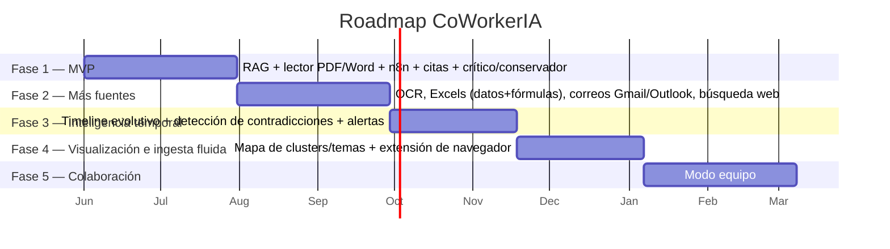
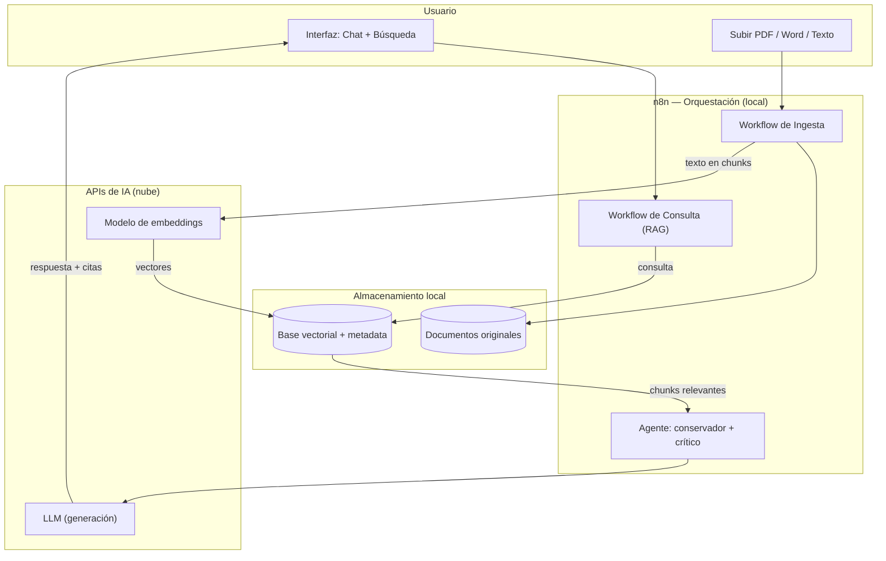
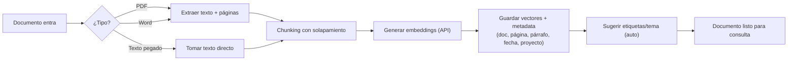
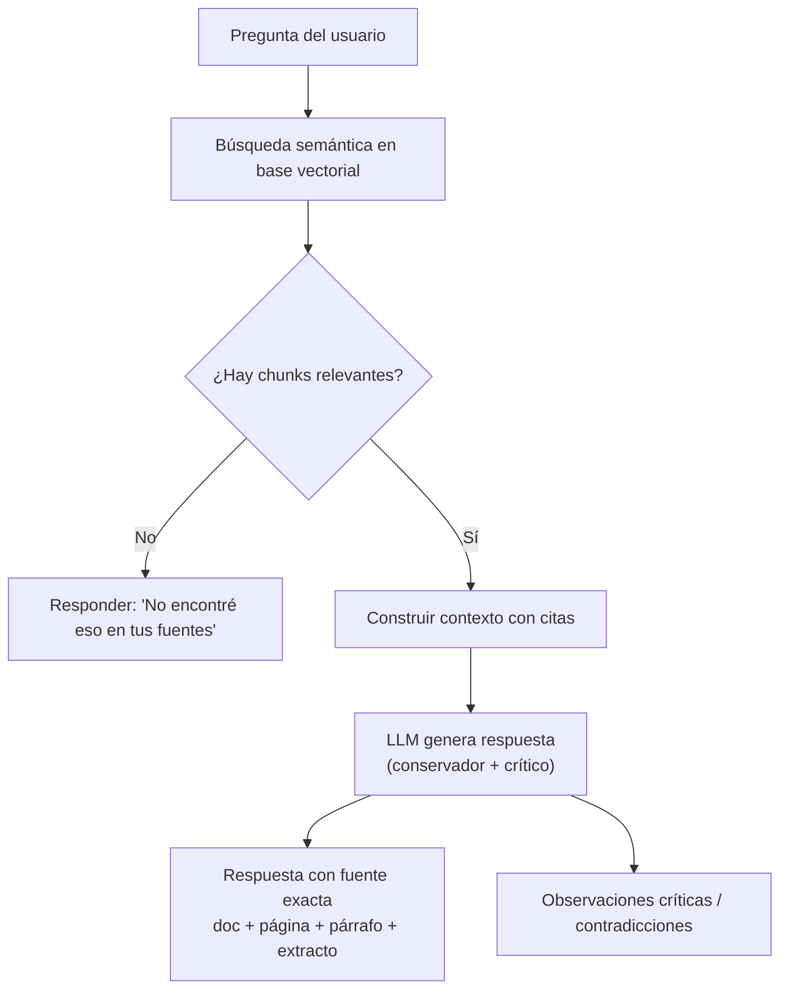

# CoWorkerIA — Product Requirements Document (PRD)

> **Tu segundo cerebro para proyectos e investigación.** Un asistente que ingiere tus documentos, correos y fuentes, los organiza solo, responde con citas exactas y rastrea cómo evolucionan las ideas en el tiempo.

| | |
|---|---|
| **Versión** | 1.0 (draft) |
| **Autor** | Jun Wei He Mai |
| **Estado** | En definición — MVP no iniciado |
| **Tipo de proyecto** | Prototipo / producto técnico (no comercialización) |
| **Familia de producto** | CoWorker (junto a CoWorkerPOS) |
| **Última actualización** | 2026-06 |

---

## 1. Resumen ejecutivo

CoWorkerIA es un asistente de conocimiento *local-first* que convierte un conjunto desordenado de documentos —papers, PDFs, Word, correos, planillas, páginas web— en un "segundo cerebro" consultable. El usuario guarda fuentes con un gesto simple; el sistema las procesa, las organiza por temas de forma automática, y permite preguntarle en lenguaje natural. Cada respuesta llega con **la fuente exacta** (documento, página, párrafo), nunca inventa, y adopta una postura **crítica** que ayuda a detectar debilidades en las ideas del propio usuario.

Su diferenciador central no es "chatear con PDFs" (eso ya existe), sino **rastrear la evolución de la información en el tiempo**: cuando una fuente del 02/04 dice X y otra del 04/04 dice Y, CoWorkerIA lo detecta, alerta de la contradicción, y muestra un *timeline* de cómo cambió la verdad.

El proyecto se construye sobre **n8n** como motor de orquestación, integrando OCR, modelos de lenguaje (vía API), una base vectorial y un agente RAG.

---

## 2. Problema

### 2.1 La escena del dolor

> Durante mi tesis de magíster leí decenas de papers y documentos. Semanas después necesitaba *aquella* idea, *aquel* dato — y no recordaba en qué documento estaba. Pasaba más tiempo buscando dónde había leído algo que usándolo. La información existía, pero estaba perdida.

Este es el dolor central: **la información se acumula más rápido de lo que se puede organizar y recuperar**. Y en contextos profesionales se agrava con un segundo problema: **la información cambia**. En un proyecto grande o en un caso legal, lo que era cierto un día se actualiza al siguiente, y saber *cuál es la versión vigente* es tan importante como encontrarla.

### 2.2 Cómo se resuelve hoy (y por qué falla)

| Método actual | Limitación |
|---|---|
| Carpetas + nombres de archivo | No escala; buscar = recordar dónde guardaste |
| Ctrl+F dentro de cada archivo | Solo busca texto literal, no entiende contexto |
| Releer todo | Inviable con cientos de documentos |
| Copiar/pegar a ChatGPT | Manual, sin memoria persistente, sin fuentes |
| Dar una carpeta completa a un asistente de IA (ej. Claude leyendo todo) | Requiere acceso a esa herramienta, no es para equipos, no persiste, no organiza ni versiona |

El patrón común: **ninguna de estas opciones organiza sola, ni cita con precisión, ni entiende que la información evoluciona.**

### 2.3 Por qué ahora

Los modelos de lenguaje, los embeddings y herramientas de orquestación como n8n hacen por primera vez viable construir esto sin un equipo de ingeniería. El stack RAG maduró; el cuello de botella ya no es técnico sino de diseño de producto.

---

## 3. Usuarios

### 3.1 Usuario primario (MVP)
**Profesional o investigador que maneja mucha información viva.** Trabaja sobre proyectos o temas con decenas o cientos de fuentes, necesita recuperar información precisa y confiar en que es la versión correcta. Ejemplos: tesista, analista, consultor, investigador.

### 3.2 Usuario secundario
**Estudiantes** (pregrado/posgrado) que gestionan bibliografía y apuntes.

### 3.3 Nicho de mayor valor
Campos donde **el volumen de información es alto y la información se actualiza constantemente**: derecho (jurisprudencia, expedientes que evolucionan), gestión de proyectos grandes (requerimientos que cambian por correo), investigación académica. Aquí el diferenciador temporal de CoWorkerIA vale más.

### 3.4 Visión a futuro (roadmap)
**Equipos** que comparten fuentes de información y correos sobre un proyecto común. Este es el segmento que justificaría un producto de pago, pero queda fuera del MVP (ver §9).

---

## 4. Propuesta de valor y diferenciación

### 4.1 La promesa
> Guarda todo de un clic. Pregúntale como a un colega experto. Recibe respuestas con fuente exacta, nunca inventadas, y mira cómo tus ideas evolucionan en el tiempo.

### 4.2 Qué lo hace distinto

| Ya existe (NotebookLM, ChatGPT, etc.) | El ángulo de CoWorkerIA |
|---|---|
| Chatea con tus PDFs | Rastrea la **evolución temporal** de la información (timeline + detección de contradicciones) |
| Resume y responde | Es **crítico**: cuestiona, señala debilidades, ayuda a mejorar las ideas |
| Una bolsa de documentos | **Se auto-organiza** en clusters/temas visualizables |
| Citas genéricas | Citas a nivel de **párrafo exacto** |
| Caja cerrada en la nube | **Local-first**: tus datos no salen salvo la llamada a la IA |

### 4.3 El criterio de éxito #1
**Entender bien el contexto y traer información correcta.** Todo lo demás es secundario. Si CoWorkerIA responde con precisión y sin inventar, cumple su razón de ser.

---

## 5. Principios de diseño

1. **Nunca inventa.** Ante la duda, responde "no encontré eso en tus fuentes". Ultra-conservador con los hechos. Es preferible callar a alucinar.
2. **Siempre cita.** Toda afirmación va anclada a su fuente exacta (documento → página → párrafo).
3. **Es crítico, no complaciente.** Actúa como un *sparring* intelectual: señala debilidades, contradicciones y supuestos no verificados para mejorar el proyecto del usuario.
4. **Local-first.** Los datos viven en la máquina del usuario. La nube se usa solo para la inferencia de IA.
5. **Se organiza solo.** El usuario no debería tener que etiquetar todo a mano; el sistema propone estructura (sin impedir el control manual).
6. **La verdad tiene fecha.** La información se trata como algo que evoluciona, no como hechos estáticos.

---

## 6. Alcance del MVP (Fase 1)

### 6.1 Las 3 capacidades núcleo
El primer hito demostrable se define por tres cosas funcionando de punta a punta:

1. **Chatbot RAG** — preguntar en lenguaje natural y recibir respuestas con citas sobre los documentos guardados.
2. **Lector de documentos** — ingesta y procesamiento de PDFs, Word y texto pegado.
3. **Orquestación en n8n** — todo el pipeline (ingesta → chunking → embeddings → base vectorial → consulta) corre y se visualiza en n8n.

### 6.2 Funcionalidades incluidas en el MVP

| # | Funcionalidad | Detalle |
|---|---|---|
| F1 | Guardar documento | Subir PDF, Word, o pegar texto |
| F2 | Procesamiento automático | Extracción de texto → chunking → embeddings → almacenamiento vectorial |
| F3 | Chat sobre el conocimiento | Preguntas en lenguaje natural, respuestas fundamentadas |
| F4 | Búsqueda | Barra de búsqueda directa además del chat |
| F5 | Citas exactas | Respuesta indica documento + página (+ párrafo cuando sea posible) |
| F6 | Modo conservador | El agente no inventa; declara cuando no encuentra |
| F7 | Modo crítico | El agente señala debilidades y contradicciones |
| F8 | Gestión de documentos | Ver lista, abrir el original, borrar |
| F9 | Concepto de "proyecto/tema" | Agrupar fuentes por tema de trabajo |

### 6.3 Tipo de respuesta esperada
Detallada, con **cita de fuente exacta**, incluyendo extractos textuales del documento de origen cuando refuerzan la respuesta.

---

## 7. Fuera de alcance del MVP

Explícitamente **no** en la Fase 1 (para mantener el MVP terminable):

- OCR de documentos escaneados
- Ingesta de Excels (datos y fórmulas)
- Conexión a Gmail / Outlook
- Búsqueda web para contrastar
- Timeline evolutivo y detección automática de contradicciones
- Mapa de clusters / visualización de temas
- Extensión de navegador
- Modo equipo / colaborativo
- Cuentas, facturación, comercialización (no es un SaaS)

Cada uno de estos está planificado en el roadmap (§9). No son descartes — son fases.

---

## 8. Requisitos funcionales detallados

### 8.1 Ingesta
- El usuario puede subir uno o varios archivos (PDF, Word) o pegar texto plano.
- El sistema confirma la ingesta y muestra el estado de procesamiento.
- Cada documento conserva metadata: nombre, tipo, fecha de ingesta, fecha del documento (si se detecta), proyecto/tema.

### 8.2 Procesamiento (pipeline RAG)
- Extracción de texto fiel al original.
- División en *chunks* con solapamiento, preservando referencia a página/posición.
- Generación de embeddings vía API.
- Almacenamiento en base vectorial local con metadata para citar.

### 8.3 Consulta
- Entrada por chat conversacional **y** por barra de búsqueda.
- Recuperación de los chunks más relevantes (búsqueda semántica).
- Respuesta generada que: (a) se basa solo en lo recuperado, (b) cita fuente exacta, (c) incluye extractos, (d) declara si no hay información suficiente, (e) añade observaciones críticas cuando aplica.

### 8.4 Gestión
- Listar documentos del proyecto activo.
- Abrir/visualizar el documento original.
- Eliminar un documento (y sus embeddings).

### 8.5 Organización
- Agrupación por proyecto/tema.
- Etiquetado **manual** del usuario **y** sugerencia **automática** del sistema (ambos coexisten).

---

## 9. Roadmap

> El MVP prueba la tesis del producto. Las fases siguientes construyen la visión completa.

| Fase | Foco | Entregables clave |
|---|---|---|
| **1 — MVP** | El núcleo RAG funciona | Chatbot RAG, lector PDF/Word/texto, n8n, citas exactas, modos conservador y crítico |
| **2 — Más fuentes** | Cubrir el caso real completo | OCR (escaneados), Excels (datos + fórmulas), correos (Gmail/Outlook), búsqueda web mixta |
| **3 — Inteligencia temporal** | El diferenciador | Timeline de evolución de ideas, detección automática de contradicciones, alerta + decisión del usuario |
| **4 — Visualización e ingesta** | Experiencia | Mapa de clusters auto-organizado, extensión de navegador para guardar de un clic |
| **5 — Colaboración** | Escalar a equipos | Cerebro compartido, fuentes y correos de equipo (posible migración a servidor central) |

### 9.1 Detalle de decisiones diferidas confirmadas
- **Búsqueda web (Fase 2):** modo **mixto** — a pedido del usuario *y* automática cuando el agente detecta que le falta información.
- **Contradicciones (Fase 3):** el agente **alerta** y deja la **decisión** al usuario (no resuelve solo).
- **Excels (Fase 2):** soportar **ambos** — leer fórmulas/lógica de cálculo *y* consultar datos.
- **Etiquetado:** **ambos** modos (manual + automático) — incluido ya desde el MVP a nivel básico.

---

## 10. Arquitectura técnica

### 10.1 Decisión de arquitectura: local-first con IA en la nube
- **Documentos y base vectorial:** locales (máquina del usuario). Coherente con uso individual, privacidad y costo cero de infraestructura.
- **Inferencia de IA (embeddings + generación):** vía API (Claude / OpenAI / opción de modelo local a futuro). Garantiza calidad de respuesta sin correr un LLM pesado localmente.
- **Orquestación:** n8n como centro del pipeline.

### 10.2 Diagrama de arquitectura (MVP)

### 10.3 Flujo de ingesta (detalle)

### 10.4 Flujo de consulta RAG (detalle)

### 10.5 Stack tecnológico propuesto

> Documentado como propuesta; sujeto a validación durante la construcción.

| Capa | Tecnología propuesta | Notas |
|---|---|---|
| Orquestación | **n8n** (self-hosted, local) | Centro del proyecto; nodos AI/LangChain |
| Extracción PDF | nodo de extracción / librería PDF | Texto + número de página |
| Extracción Word | librería de parsing .docx | |
| Chunking | nodos n8n / código JS | Con solapamiento y metadata de posición |
| Embeddings | API (OpenAI `text-embedding-3` o equivalente) | Decidir según costo/calidad |
| Base vectorial | **Qdrant** o **Chroma** (local) | A validar; ambas corren local |
| LLM (generación) | Claude (Anthropic API) | Para respuestas y modo crítico |
| Agente | nodo **AI Agent** de n8n (LangChain) | Memoria + herramientas |
| Interfaz | Chat web ligero + barra de búsqueda | A definir; puede empezar en la propia UI de n8n |

*(La elección final de base vectorial y modelo de embeddings se cerrará en la fase de construcción tras una prueba comparativa.)*

---

## 11. Métricas de éxito

### 11.1 Métrica de producto (la que importa)
**¿La persona o el equipo avanza más rápido y está más organizado gracias a CoWorkerIA?** Señales concretas:

1. **Precisión de recuperación:** el porcentaje de preguntas respondidas con la fuente correcta (medible con un set de preguntas de prueba sobre documentos conocidos).
2. **Tasa de "no inventar":** cero respuestas fabricadas; cuando no hay información, lo declara.
3. **Tiempo a la respuesta:** cuánto tarda el usuario en encontrar un dato vs. el método manual (buscar en carpetas / releer).

### 11.2 Métricas técnicas de apoyo
- Latencia de respuesta del pipeline RAG.
- Calidad de las citas (¿la cita apunta realmente al párrafo correcto?).
- Cobertura de formatos ingeridos sin error.

### 11.3 Hipótesis de valor comercial (visión, no MVP)
El segmento dispuesto a pagar serían **equipos grandes que comparten fuentes y correos** sobre un proyecto. El valor está en la organización compartida y la trazabilidad de cómo evoluciona la información del proyecto. Esto pertenece a la Fase 5 y se documenta como hipótesis, no como objetivo del prototipo.

---

## 12. Narrativa de portafolio

**Audiencia:** LinkedIn / comunidad técnica y reclutadores de empresas orientadas a IA.

**Frase central:**
> "Construí un producto que automatiza, organiza ideas y ayuda a la toma de decisiones en tus proyectos."

**Qué demuestra este proyecto (las tres a la vez):**
- **Que sé IA:** RAG, embeddings, agentes, OCR, orquestación, bases vectoriales.
- **Que pienso como producto:** problema real, scope disciplinado (MVP vs roadmap), métricas, principios de diseño, decisiones justificadas.
- **Que ejecuto:** de la definición al prototipo funcional sobre n8n.

---

## 13. Riesgos y mitigaciones

| Riesgo | Mitigación |
|---|---|
| Scope creep (todo en el MVP) | Corte estricto MVP/roadmap ya definido (§6, §7, §9) |
| Calidad de citas (que el párrafo citado sea el correcto) | Guardar metadata de posición desde la ingesta; validar con set de prueba |
| Alucinaciones del LLM | Principio "nunca inventa"; prompt conservador; declarar ausencia de info |
| Costos de API de IA | Local-first reduce costo; medir uso; opción de modelo local a futuro |
| Heterogeneidad de formatos | Diferir formatos complejos (Excel, OCR, correo) a Fase 2 |
| Confusión de marca con CoWorkerPOS | Posicionar explícitamente como familia de productos "CoWorker" |

---

## 14. Preguntas abiertas

- ¿Base vectorial definitiva: Qdrant vs Chroma? (decidir en construcción)
- ¿Modelo de embeddings: costo vs calidad? (prueba comparativa)
- ¿La interfaz del MVP empieza en la UI de n8n o se construye una propia desde el inicio?
- ¿El "proyecto/tema" es una carpeta lógica o un cerebro separado por completo?
- Nivel de cita "párrafo exacto": ¿alcanzable de forma fiable en el MVP o es objetivo de Fase 2?

---

*Documento vivo. Próximo paso: validar el stack (Sesión 0) e iniciar el pipeline de ingesta en n8n (Sesión 1).*
